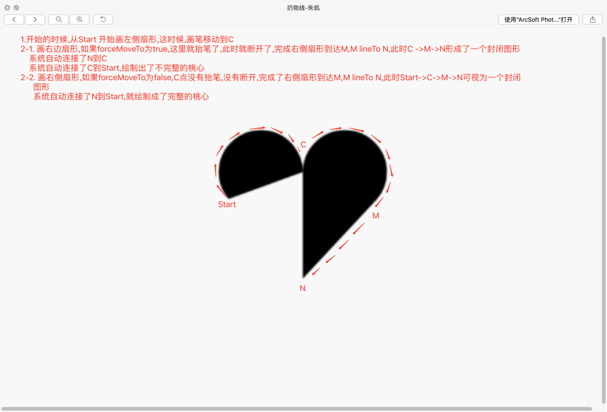
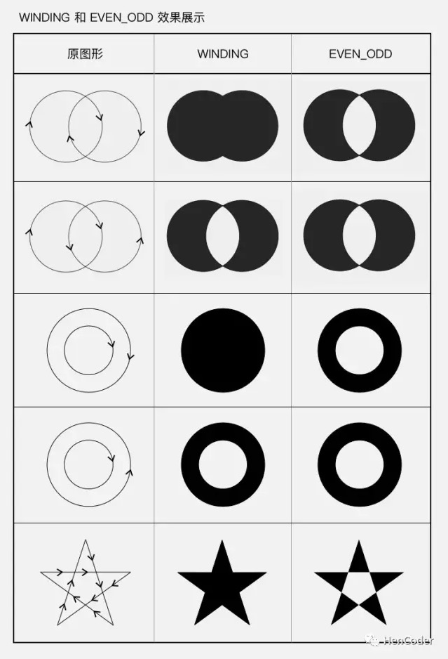

#Android开发进阶:自定义View 1-1 绘制基础(自我总结和练习感悟) 
#原文地址:[Android 开发进阶: 自定义 View 1-1 绘制基础](https://mp.weixin.qq.com/s?__biz=MzIwNTczNTY0NA==&mid=2247483657&idx=1&sn=0e3a9f84d9924ef4125c885592dbb843&chksm=972d12baa05a9bac18af5d335d65eba9b71146a9fec143be6ecf62d4a4bd2e7179c726cdbb81&mpshare=1&scene=1&srcid=07103TebqK8ayqL65sFM10aG&key=2872d7939faa95a4746f02817e96c6a1eb3d50ffa721de271927326d3f89f9d76134ce490ee10917c24434ccd1d80bd50cdb6fc724f8cd642c125bedb9bb15ae60355472d73d8a8d2ae254af35799487&ascene=0&uin=NjM2OTY1&devicetype=iMac+MacBookPro11%2C4+OSX+OSX+10.12.5+build(16F73)&version=12020810&nettype=WIFI&fontScale=100&pass_ticket=FaWZgAC6HjXFxVzB307KYZzsfTzz3EzqIsGyEl40QcY%3D##)
## 1.自定义绘制知识的四个级别
 * Canvas 的 drawXXX() 系列方法及 Paint 最常见的使用
 * Paint 的完全攻略
 * Canvas 对绘制的辅助——范围裁切和几何变换
 * 使用不同的绘制方法来控制绘制顺序
 
## 2.Canvas.drawXXX() 和 Paint 基础
 * Canvas.drawColor(@ColorInt int color) 颜色填充,绘制底色
 * drawCircle(float centerX, float centerY, float radius, Paint paint) 画圆
 * Paint.setColor(int color) 设置画板的颜色
 * Paint.setStyle(Paint.Style style) 设置画板的模式,Style 具体来说有三种： FILL, STROKE 和 FILL_AND_STROKE 。FILL 是填充模式，STROKE 是画线模式（即勾边模式），FILL_AND_STROKE 是两种模式一并使用：既画线又填充。它的默认值是 FILL，填充模式。
 * Paint.setStrokeWidth(float width) 设置线条的宽度
 * Paint.setAntiAlias(boolean aa)
 * drawRect(float left, float top, float right, float bottom, Paint paint) 画矩形
 * drawPoint(float x, float y, Paint paint) 画点
 * drawPoints(float[] pts, int offset, int count, Paint paint) / drawPoints(float[] pts, Paint paint) 画点（批量）
 * drawOval(float left, float top, float right, float bottom, Paint paint) 画椭圆
 * drawLine(float startX, float startY, float stopX, float stopY, Paint paint) 画线
 * drawLines(float[] pts, int offset, int count, Paint paint) / drawLines(float[] pts, Paint paint) 画线（批量）
 * drawRoundRect(float left, float top, float right, float bottom, float rx, float ry, Paint paint) 画圆角矩形
 * drawArc(float left, float top, float right, float bottom, float startAngle, float sweepAngle, boolean useCenter, Paint paint) 绘制弧形或扇形 sweepAngle 是弧形划过的角度；useCenter 表示是否连接到圆心，如果不连接到圆心，就是弧形，如果连接到圆心，就是扇形。
 * drawPath(Path path, Paint paint) 画自定义图形
 	* Path 方法第一类：直接描述路径 (这一类方法还可以细分为两组：添加子图形和画线（直线或曲线）)
 		* 第一组： addXxx() ——添加子图形
 			* addCircle(float x, float y, float radius, Direction dir) 添加圆  最后一个参数 dir 是画圆的路径的方向。路径方向有两种：顺时针 (CW clockwise) 和逆时针 (CCW counter-clockwise) 。 	
 			* addOval(float left, float top, float right, float bottom, Direction dir) / addOval(RectF oval, Direction dir) 添加椭圆
			* addRect(float left, float top, float right, float bottom, Direction dir) / addRect(RectF rect, Direction dir) 添加矩形
			* addRoundRect(RectF rect, float rx, float ry, Direction dir) / addRoundRect(float left, float top, float right, float bottom, float rx, float ry, Direction dir) / addRoundRect(RectF rect, float[] radii, Direction dir) / addRoundRect(float left, float top, float right, float bottom, float[] radii, Direction dir) 添加圆角矩形
         * addPath(Path path) 添加另一个 Path
      
      * 第二组：xxxTo() ——画线（直线或曲线）(这一组和第一组 addXxx() 方法的区别在于，第一组是添加的完整封闭图形（除了 addPath() ），而这一组添加的只是一条线。)
      		* lineTo(float x, float y) / rLineTo(float x, float y) 画直线
			* quadTo(float x1, float y1, float x2, float y2) / rQuadTo(float dx1, float dy1, float dx2, float dy2) 画二次贝塞尔曲线
			* cubicTo(float x1, float y1, float x2, float y2, float x3, float y3) / rCubicTo(float x1, float y1, float x2, float y2, float x3, float y3) 画三次贝塞尔曲线
			* moveTo(float x, float y) / rMoveTo(float x, float y) 移动到目标位置
			* arcTo(RectF oval, float startAngle, float sweepAngle, boolean forceMoveTo) / arcTo(float left, float top, float right, float bottom, float startAngle, float sweepAngle, boolean forceMoveTo) / arcTo(RectF oval, float startAngle, float sweepAngle) 画弧形
			* close() 封闭当前子图形
			* close() 和 lineTo(起点坐标) 是完全等价的。(另外，不是所有的子图形都需要使用 close() 来封闭。当需要填充图形时（即 Paint.Style 为 FILL 或 FILL_AND_STROKE），Path 会自动封闭子图形。)
	
	* Path 方法第二类：辅助的设置或计算
		* Path.setFillType(Path.FillType ft) 设置填充方式
		 * EVEN_ODD
		 * WINDING （默认值）
		 * INVERSE_EVEN_ODD
		 * INVERSE_WINDING
* drawBitmap(Bitmap bitmap, float left, float top, Paint paint) 画 Bitmap
* drawText(String text, float x, float y, Paint paint) 绘制文字

## 3.遇到的问题详解
### 3.1 path的两类方法的区别
	 addXxx 是添加子图形(画圆形,矩形), xxxTo是画线(直线或者曲线),这里有个特殊的方法  addArc(),开始以为它是画扇形的,实际上它也是画线了,在最后一个例子使用这个方法是不能画出来扇形了,只能画出扇形那条线

### 3.2 关于forceMoveTo的理解,在画桃心的时候,开始的时候一直画不出来,或者画出来是乱七八糟的,其实就是这个参数造成的问题,理解这个问题可以直接看图
	forceMoveTo 参数的意思是，绘制是要「抬一下笔移动过去」，还是「直接拖着笔过去」，区别在于是否留下移动的痕迹,重点就是理解,当forceMoveTo=true的时候,就会抬笔,会断开当前的点,开始新图形的绘制
	

### 3.3 Path.setFillType(Path.FillType ft) 设置填充方式
	这个点没有花时间去仔细研究,具体问题可以看图来理解
	

### 3.4 画统计图,圆柱体的时候,文字不能对其圆柱体的中间显示
	paint.setTextAlign 使用这个API可以达到效果

